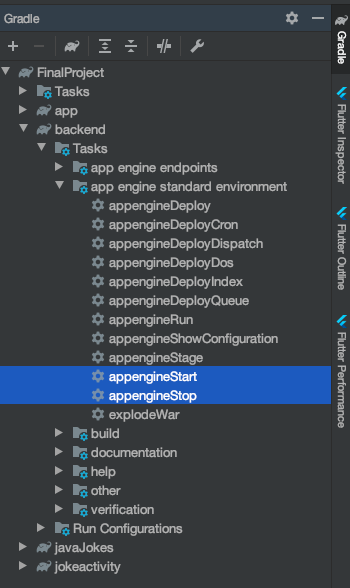
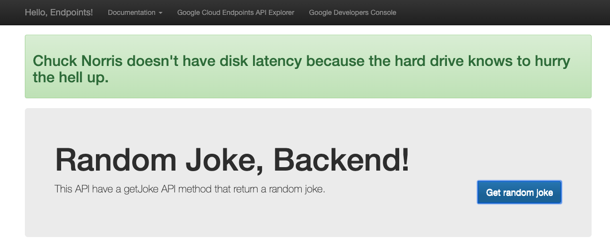
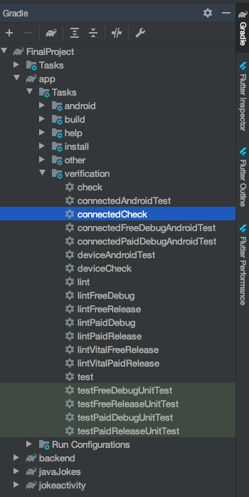
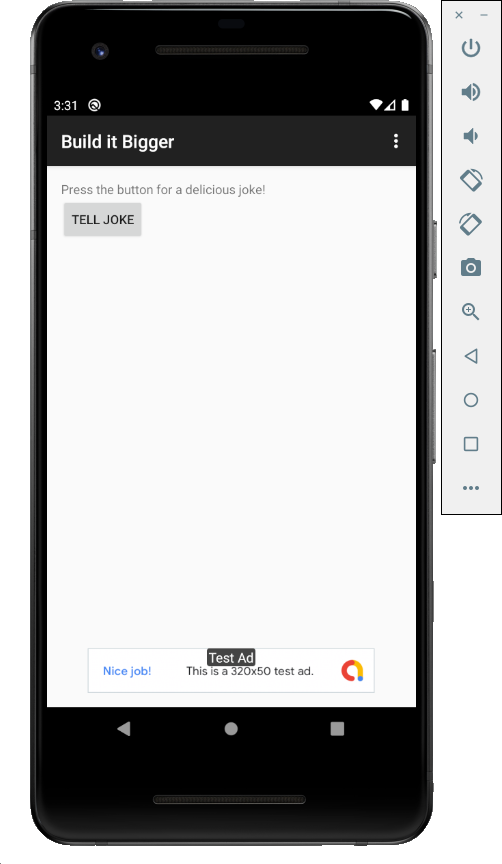
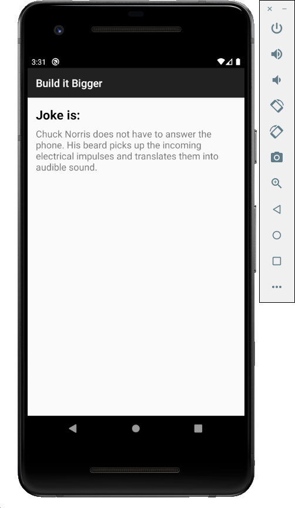

# Build It Bigger

This Project an example for controller big project with different resources like java library or Android library or Google cloud backend or ... .

## Preview

**Build It Bigger** have different libraries and Android Test with different product flavors.

Libraries are:

1. Joke Activity - Android liberery that handle activity for show joke.
2. Java Jokes - Java libreery that fech randome joke from [API](https://jokes.guyliangilsing.me/retrieveJokes.php?type=random).
3. Backend - Java librery that worke on Goole Cloud, get joke from **Java Jokes** and make available for **App**.

Android Test are:

1. JokeTaskAndroidTest - Android Test for check respone of **AsynkTask** of joke (that called backend).

Product flavors are:

1. Free - In This flavor, **Main Activity** of **App** contains Google Ads.
2. Paid - In This flavor, **Main Activity** of **App** does not contains Google Ads.

## Getting Started

1. Install the [Cloud SDK](https://cloud.google.com/sdk/docs).
2. Set up the Cloud SDK.

   1. Initialize the Cloud SDK:

      ```bash
      gcloud init
      ```

   2. Use Application Default Credentials:

      ```bash
      gcloud auth application-default login
      ```

   3. Install the app-engine-java component:

      ```bash
      gcloud components install app-engine-java
      ```

3. Start local server:

   1. Run **appengineStart** task by using the gradle tasks:

      

   2. Ckeck local GCE server, you should see the following at [localhost:8080](http://localhost:8080), press **Get random joke**:

      

4. Test **JokeTaskAndroidTest** with run **connectedCheck** task by using the gradle tasks

   

5. Run App in **Free** or **Paid** flavor

   1. **Free** flavor

      

      

   1. **Paid** flavor

      

      
